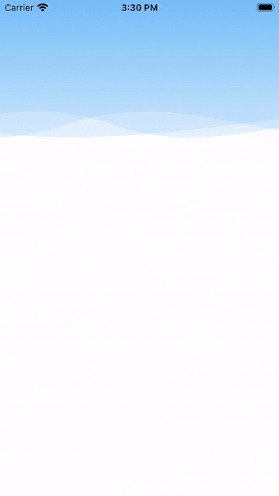
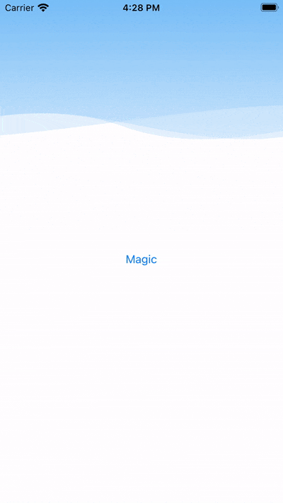

# AJWaveView

## Demo

 

## About The Project

An UIKit wave view.

### Build With

[Objective-C](https://developer.apple.com/library/archive/documentation/Cocoa/Conceptual/ObjectiveC/Introduction/introObjectiveC.html)

## Getting Started

### Installation

Just copy *AJWaveView.h* and *AJWaveView.m* to your project.

## Usage

Drag an UIView to xib or storyboard, then assign custom class to AJWaveView.

Offering following methods to use:

```objectivec

/// Adjust cycle duration time.
/// @param duration wave cycle duration time
- (void)animateMovingWaveWithBaseDuration:(CFTimeInterval)duration;

/// Animating change wave color.
/// @param toColorType which color to change
/// @param duration wave cycle duration time
/// @param completion animating end completion block
- (void)animateShfitingColorsToAJWaveColorType:(AJWaveColorType)toColorType andDuration:(CFTimeInterval)duration withCompletion:(void(^)(void))completion;

```

## License

[WTFPL](http://www.wtfp)
